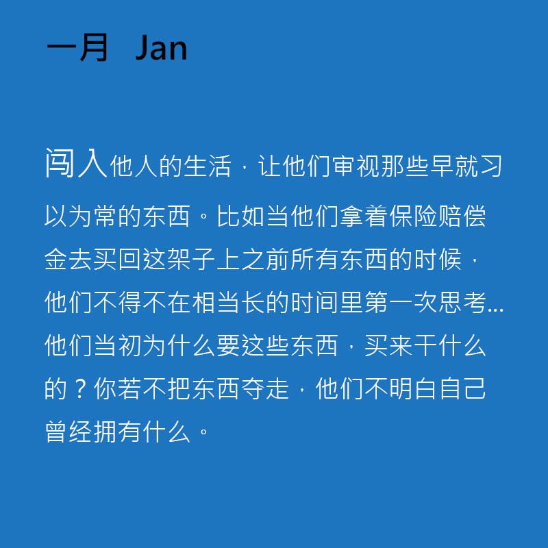

2016.1.02-2
============
新年第二天，开始列一月的计划。2016年第一个月无疑是关键的，一年的计划从这个月开始，改变也是从这个月开始。所以根据年计划就有了下面的月计划，之后估计还会有周计划，天计划。是的，这一年的关键词就是计划。

1. 照片。现在Instagram上的照片有3552张，根据年计划，这个月应该要上传120张照片，到月底应该会达到3673张照片。其他的事情，这个月先暂时不安排了。
2. 阅读。现在douban上标记的图书有724本，根据年计划，这个月应该要阅读6本书，月底达到730本书。这六本书涵盖的范围应该有工作上的、计算机历史、设计、机器人及其他。再次提醒，认真选书，阅读的时候应该精读，做好笔记。
3. 电影。现在douban上标记的电影有1795部，根据年计划，这个月应该要看5部电影，月底达到1800部电影。将看电影的时间留给电影，谨慎选择电影，多写影评。
4. 音乐。现在douban上标记的音乐专辑有645张，根据年计划，这个月应该要听9张专辑，月底专辑数量达到653张。留出时间只听音乐，听的时候可以去了解下相关的背景知识。
5. 写作。现在主要有两个平台，一个是2016-Daily-Pushing，这个主要是写一些每天的所感所想、随笔性质的，会比较偏私人一些，内容也不会太多。另一个是公众号，这个就比较正式一点了，主要内容会是关于设计、积极心理学、计算机历史、机器人、翻译、读书笔记等。而且这两个平台计划都是要每天更新的（尤其是前者），所以每天的写作任务量还是挺大的。其次可以好好利用Day One和豆瓣小组，这两者可以作为积累素材的场所。
6. 学习设计。这个月主要是看书，做好笔记，前期内容会比较散，可以将内容放在豆瓣小组里。关于技能的学习，这个月主要学习Sketch。
7. 积极心理学。首先是将课程的笔记在公众号上推送完，之后再重温一下《幸福的方法》这本书，做好学习笔记（可以作为公众号的内容）。然后有精力可以初步设计推广积极心理学的网站。
8. 机器人。计划这个月主要是看书和论文，主要精力放在研究机械结构上。计划建一个网站（或利用现有的）来记录学习的内容。
9. 计算机发展的历史。这个月主要是积累素材和看书，可以将笔记放在豆瓣小组上。
10. 托福考试。这个月先把托福考试官方指南上的内容复习好就行了。
11. 工作。这个月应该会进行一些年终总结，所以应该做一些准备。作为新的一年，这个月应该好好理清自己的工作内容，找到自己要学习和努力的方向。养成好的工作习惯。
12. 习惯。新的一年第一个月，应该要养成好的习惯。例如：凡事做好计划，最好是写出来，每个月做好月计划，每周做好周计划，每一天做好这一天的计划；做好总结，做好每天的总结，做好每周的总结，做好每月的总结；做好笔记，不管是看书、看视频、看新闻还是其他，都应该时刻做好笔记，不管是写下来还是敲下来；养成好的作息习惯，最好每天十点要上床，十一点前睡着，每天睡够八个小时；要早起，做好一天的准备；每天留出专门阅读的时间... ...

2016.1.2