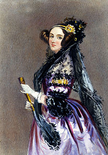

2016.1.07-7
============
接着昨天的介绍，今天介绍被后人公认为第一位计算机程序员——埃达·洛夫莱斯。Ada Lovelace，又译阿达·奥古斯塔，1815年12月10日－1852年11月27日，是著名英国诗人拜伦之女。

“我相信自己拥有一套非常独特的特质组合，恰好让我适合成为一名非凡的发现者，去揭示自然隐秘的真相······这个信念很久以来一直挥之不去，而慢慢地我也已经接受了这一点”

在1842年与1843年期间，埃达花了9个月的时间翻译意大利数学家路易吉·米那比亚讲述查尔斯·巴贝奇计算机分析机的论文。在译文后面，她增加了许多注记，详细说明用该机器计算伯努利数的方法。这些注释给出了一个比巴贝奇以往提出的还要更具普遍性、前瞻性的未来设想。有多普遍？这台机器不仅仅执行计算，它还执行运算（operations）。按照埃达的说法，运算指“任何改变了两种或多种事物之间相互关系的过程”，因而“这是一个最普遍的定义，涵盖了宇宙间的一切主题”。而关于运算的科学，在她的设想中，

“是一门独立的科学，自有其抽象真理和价值；正如逻辑自有其特别的真理和价值，而独立于那些我们借助逻辑的推理和过程来进行研究的主题······之所以运算科学的独立性很少有人感受到，且总体上也很少有人谈论，一个主要原因是数学记法中的许多符号有着不断变换的意义。”（信息简史）

不过，有传记作者也因为部分的程序是由巴贝奇本人所撰，而质疑埃达在计算机程序上的原创性。巴贝奇在他所著的《经过哲学家人生》（Passages from the Life of a Philosopher, 1846）里留有下面的述叙：

	我认为她为米那比亚的备忘录增加许多注记，并加入了一些想法。虽然这些想法是由我们一起讨论出来的，但是最后被写进注记里的想法确确实实是她自己的构想。我将许多代数运算的问题交给她处理，这些工作也与伯努利数的运算相关。在她所送回给我的文档，更修正了我先前在程序里的重大错误。

埃达的文章创造出许多巴贝奇也未曾提到的新构想，比如埃达曾经预言道：‘这个机器未来可以用来排版、编曲或是各种更复杂的用途。’。

她死后一百年，于1953年，埃达之前对查尔斯·巴贝奇的《分析机概论》所留下的笔记被重新公布，并被认为对现代计算机与软件工程造成了重大影响。

埃达死于子宫癌，这是一种经年累月的痛苦折磨，即便服用鸦片和大麻也不能减轻多少。在很长一段时间内，她的家人都对她隐瞒了病情的真相。但最终她还是知道了自己时日不多。她在给母亲的信中写道：“人们常说‘将来之事会提前投下其阴影’，可是它们有时不也会提前投下其光芒吗？”她死后被葬在了她父母的旁边。（信息简史）

埃达对于未来也有一个最后的梦想：“我以我自己的方式迟早会成为一名独裁者。”在她面前将集结起一个个军团，对此即便是地上的铁腕统治者们也只能乖乖让路。那么她的军团由什么材料构成呢？“我现在可不会说。但我希望，它们将是纪律严明、异常和谐的军队——由大量的数构成，伴着军乐以势不可挡的力量行进。这听起来岂不是十分神秘？显然我的军队必须由数构成，否则他们也就根本不可能存在······但如果进一步问，这又是些什么数？这则是一个迷——”（信息简史）

2016.1.7