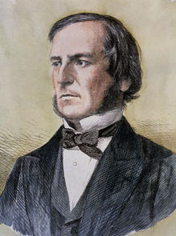

2016.1.08-8
============
今天继续介绍计算机历史上的一位人物——乔治·布尔。George Boole，1815年11月2日－1864年12月8日，英格兰数学家和哲学家，数理逻辑学先驱。

1847年，布尔出版了《The Mathematical Analysis of Logic(逻辑的数学分析)》，这是他对符号逻辑诸多贡献中的第一次。1849年，他被任命位于爱尔兰科克市的皇后学院（今科克大学）的数学教授。1854年，他出版了《The Laws of Thought》，这是他最著名的著作。在这本书中布尔介绍了现在以他的名字命名的布尔代数。由于其在符号逻辑运算中的特殊贡献，很多计算机语言中将逻辑运算称为布尔运算，将其结果称为布尔值。

布尔设想的体系是一种不包含数的数学。他写道：“逻辑学的公理，即仅靠它们就可以构建出逻辑科学的那些定律，其形式和表达都是数学的，尽管不是计量的数学：这是一个事实。”其中允许使用的数只有0和1，用以表示全无和全有：“符号0和1在逻辑体系中的相应解释是空类（Nothing）和全类（Universe）。”在此之前，逻辑学一直从属于哲学；而现在，布尔要代表数学将逻辑学收入麾下。为此，他设计了一种全新的编码形式，其码本融合了两套抽象的符号体系：一套是数学的形式主义中借用的字符，如P和q、+和-，以及大小括弧等；另一类则是通常用含糊多变的日常语言表达的运算、命题和关系，如表示真和伪、类的个体、前提和结论等的字词，以及各种“小品词”，如if、either、or等。（信息简史）

布尔逻辑被认为是奠定了信息时代的基础。他自己称：

> No general method for the solution of questions in the theory of probabilities can be established which does not explicitly recognise, not only the special numerical bases of the science, but also those universal laws of thought which are the basis of all reasoning, and which, whatever they may be as to their essence, are at least mathematical as to their form.

2016.1.8