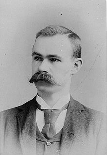

2016.1.09-9
============
今天继续介绍计算机历史上的人物——赫尔曼·何乐礼，Herman Hollerith或译赫尔曼·霍尔瑞斯，1860年2月29日－1929年11月17日。他是一位德裔美籍的统计学家和发明家。基于打孔卡技术，他发明了打孔卡片制表机（Tabulation Machine）。他也是制表机器公司（Tabulating Machine Company）的创办者，该公司是IBM的前身之一。何乐礼被广泛认为是现代机械数据处理之父。随着他发明的制表机，自动数据处理的时代开启。

1879年他从哥伦比亚大学矿业学院“矿业工程”（Engineer of Mines）专业毕业，当年19岁。1880年在美国人口普查局工作，这是一份费力而容易出错的工作。在约翰·肖·比林斯的敦促下，赫尔曼·何乐礼发明了使用电气连接触发记录信息的机器。这个机器的关键点在与其可以从卡片上的特定排列的孔洞分析出数据来。他的博士论文《An Electric Tabulating System》（1889）便是以此为题。同年1月8日，赫尔曼·何乐礼申请了美国专利第395,782号，专利名为“编译数据艺术”（Art of Compiling Statistics）。

他的机器实际上是在美国人口调查局的合约下完成的，制成后被用于1890年美国人口普查，普查工作因此得以在一年之内完成。之后赫尔曼开始自己经营业务，并创立了制表机器公司（Tabulating Machine Company），向全世界的人口统计局推售自己的产品。1911年该公司并入计算制表记录公司（Computing Tabulating Recording Company）。1924年此公司更名为万国商业机器公司。

2016.1.9