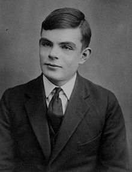

2016.1.11-11
============
今天继续介绍计算机史上的人物，今天要介绍的是被视为计算机科学之父——阿兰·图灵（Alan Turing），1912年6月23日－1954年6月7日），英国计算机科学家、数学家、逻辑学家、密码分析学家和理论生物学家。阿兰·图灵的故事很多，做过的事情也很多，不过下面将主要介绍他在推动计算机发展所做的事情。

1931年图灵进入剑桥大学国王学院，毕业后到美国普林斯顿大学攻读博士学位。图灵在普林斯顿大学度过了1937年和1938年的大部分时间，在邱奇指导下学习。1938年，他获取了博士学位。他的论文介绍了超计算的概念，在图灵机加上了预言机，让研究图灵机无法解的问题变得可能。

1939年图灵回到剑桥，聆听了维特根斯坦关于数学基本原理（Foundations of mathematics）的讲座。他们激烈地争论，图灵为形式主义辩护，而维特根斯坦则认为把数学抬得太高而且不能发现任何绝对真理。

1939年图灵被英国皇家海军招聘，并在英国军情六处监督下从事对德国机密军事密码的破译工作。两年后他的小组成功破译了德国的密码系统Enigma，从而使得军情六处对德国的军事指挥和计划了如指掌。但是军情六处以绝密为由隐瞒了图灵小组的存在和成就，将其所得情报据为己有。图灵小组的杰出工作，使得盟军提前至少两年战胜了纳粹德军。

1945年到1948年，图灵在国家物理实验室负责自动计算引擎（ACE）的研究工作。1949年，他成为曼彻斯特大学计算机实验室的副主任，负责最早的真正的计算机---曼彻斯特一号的软件工作。在这段时间，他继续作一些比较抽象的研究，如“计算机械和智能”。图灵在对人工智能的研究中，提出了一个叫做图灵测试（Turing test）的实验，尝试定出一个决定机器是否有感觉的标准。

图灵在他的重要论文《论可计算数及其在判定问题上的应用》（英语：On Computable Numbers, with an Application to the Entscheidungsproblem，1936年5月28日提交）里，对哥德尔1931年在证明和计算的限制的结果作了重新论述，他用现在叫做图灵机的简单形式设备代替了哥德尔的以通用算术为基础的形式语言。由于速度很慢，尽管没有一台图灵机会有实际用途，图灵还是证明了这样的机器有能力解决任何可想像的数学难题，如果这些难题是用一种算法来表达。现今，图灵机还是计算理论研究的中心课题。他继续证明了判定问题（Entscheidungsproblem）是没有答案的。他的证明首先展示了图灵机的停机问题（Halting problem）是没有答案的，这是说不可能用一个算法来决定一台指定的图灵机是否会停机。尽管他的证明比阿隆佐·邱奇在λ演算方面相等的证明晚发表了几个月，图灵的著作是更易于理解和直观的。他的通用（图灵）机的概念也是新颖的。这一通用机能够完成任何其他机器所能做的任务。这篇论文还介绍了可定义数的概念。

2016.1.11