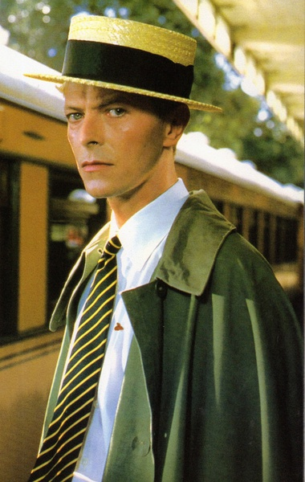

2016.1.12-12
============
昨天大卫·鲍伊去世了，新闻上各种报道，但是刚听到这名字并不是很熟悉，晚上的时候听他的音乐还比较喜欢。今天才知道，前段时间圣诞节的时候看了一部他主演的电影《Merry Christmas, Mr. Lawrence》，原来冥冥之中已经有了这样的缘分。今天就介绍一下他。

大卫·罗伯特·琼斯（英语：David Robert Jones，1947年1月8日－2016年1月10日），艺名大卫·鲍伊（David Bowie），是英国摇滚音乐家、词曲创作人、唱片制作人和演员。四十多年来，鲍伊一直是流行音乐界的重要人物，他的作品，尤其是在70年代的音乐探索，对整个乐坛起着开创性的作用。同时，他还以自己独特的声线以及作品的深度和折衷主义精神而闻名。

1969年7月，鲍伊的歌曲“Space Oddity”打入英国单曲排行榜前五名，他也由此进入了大众的视野。经过为期三年的实验探索后，他在1972年以外观华丽和雌雄同体的Ziggy Stardust形象出现，并以流行单曲“Starman”和专辑《The Rise and Fall of Ziggy Stardust and the Spiders from Mars》为先锋，宣告了华丽摇滚时代的到来。鲍伊当时的形象，在传记作家大卫·伯克利看来，“挑战了当时摇滚乐的核心价值观”，并“创造了或许是流行文化中最为突出的偶像崇拜”。事实证明，Ziggy Stardust只是鲍伊在自己音乐生涯中不断在音乐和形象上的创新的一个开始。

1975年，鲍伊凭借头榜单曲“Fame”和专辑《Young Americans》在美国首获成功。这张专辑在音乐风格上变化显著，在最初疏远了许多他在英国的歌迷。接着鲍伊再次勇敢创新，于1977年发行了简约主义专辑《Low》。这是他与制作人布莱恩·伊诺两年三张专辑合作的开始——三张“柏林三部曲”专辑都打入了英国专辑排行榜的前五名，并且取得了持久的赞誉。

在商业成功时起时落的70年代过后，鲍伊在1980年的单曲“Ashes to Ashes”取得英国单曲排行榜头榜位置，他的专辑《Scary Monsters (and Super Creeps)》亦取得专辑榜头名。1981年他与皇后乐队合作的单曲“Under Pressure”再次夺下单曲头名。1983年鲍伊在商业上达到一个新的顶峰，专辑《Let's Dance》中产生了多首流行单曲。90年代至21世纪初，他继续在音乐风格上进行实验性的探索，其中包括蓝眼灵魂乐、工业音乐等。自从2003-04年的Reality Tour之后他就再也没有进行过巡回演出，而在2006年之后便再也没有进行过现场演出。2013年3月，他发行了新的专辑《The Next Day》。2016年1月8日发表了最新的专辑《Blackstar》，并于同年1月10日，鲍伊因癌症病逝，享寿69岁。

大卫·伯克利在提到鲍伊时说，“他对流行文化的影响是相当独特的——他的形象创造和变革比任何人都多。”以带领时尚的先知先觉而被称为变色龙的鲍伊，同时是十分坚持于自己的理想及创意的。首次受到瞩目是1969年的乡村摇滚单曲《奇怪的空间》，不过最广人知的还是华丽摇滚时期的Hunky Dory（1971年），The Rise and Fall of Ziggy Stardust and the Spiders from Mars（1972年），以及Aladdin Sane（1973年）。其后拓展其音乐版图至电子乐，灵魂乐以及新浪潮，往往都是在这些类型尚未受人注意时，鲍伊就先洞察到其中特质。

除了在音乐上的卓越表现，鲍伊也是个称职的好演员。曾经参与演出《天降财神》(The Man Who Fell to Earth，1976年）、《俘虏》（Merry Christmas, Mr. Lawrence）、《千年血后》(The Hunger，1983年）、《魔幻迷宫》(Labyrinth，1986年）、The Last Temptation of Christ与Basquiat（1996年）。

2016.1.12