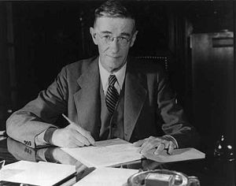

2016.1.13-13
============
今天继续介绍计算机史上的人物，今天要介绍的这位不仅对计算机的发展和互联网的产生带来重要影响，而且也对美国科学体系的建立产生重要的影响。他就是万尼瓦尔·布什（Vannevar Bush，1890年3月11日－1974年6月30日），美国著名工程师，科学家管理者。

1913年万尼瓦尔毕业于塔夫茨大学，同时取得学士和硕士学位。在硕士论文中他提出了一种名为轮廓仪(Profile Tracer)的装置，类似于割草机，由两个轮子和一支笔组成，能够实时画出走过的路径。

1916年万尼瓦尔取得MIT和哈佛大学联合博士学位后开始在塔夫茨大学任职，并加入美国无线电研究公司(AMRAD, American Radio and Research Cooperation)研究院。随后随着一战爆发，他加入美国国家研究委员会，发明了检测潜艇的木质前身。

1919年万尼瓦尔离开塔夫茨大学加入MIT。从1927年开始，在MIT担任电子工程学教授的万尼瓦尔 和一个研究小组开始着手设计能够求解微分方程的“微分分析机”的工作，造出世界上首台模拟电子计算机。这一开创性工作为二战后数字计算机的诞生扫清了道路。40年代早期，作为罗斯福总统的科学顾问，万尼瓦尔组织和领导了制造第一颗原子弹的著名的“曼哈顿计划”。其后，他先后参与了从氢弹的发明、登月飞行直到“星球大战计划”的众多重大的科学技术工程。美国政府依据万尼瓦尔的建议和构想批准成立的国家科学基金会（NSF）和高级研究规划署（ARPA）等科研机构保证了美国在尖端科技领域的长期领先地位。

万尼瓦尔是著名的曼哈顿计划的组织者和领导者。1945 年，万尼瓦尔在"Atlantic Monthly"7月号发表了一篇名为"As We May Think"的文章。文章描述了一种被称为MEMEX的机器，其中已经具备今天的超文本和超连接概念。他因此而被称为互联网先知。

2016.1.13