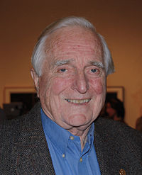

2016.1.17-17
============
今天要介绍的这位人物，很多人都只认为他发明了鼠标，而事实上他做的工作还有很多。今天要介绍的就是——道格拉斯·卡尔·恩格尔巴特（Douglas Carl Engelbart，1925年1月30日－2013年7月2日），小名道格·恩格尔巴特（Doug Engelbart），美国发明家，瑞典人和挪威人后裔。最广为人知的是他发明了鼠标，另外他的小组是人机交互的先锋，开发了超文本系统、网络计算机，以及图形用户界面的先驱；并致力于倡导运用计算机和网络，来协同解决世界上日益增长的紧急而又复杂的问题。2013年7月2日因肾衰竭于加利福尼亚阿瑟顿的家中逝世，享寿88岁。

1925年1月30日，恩格尔巴特生于美国俄勒冈州的波特兰。1942年，他自波特兰的富兰克林高中毕业。

二战期间，恩格尔巴特在菲律宾当一名海军无线电技术员，他从万尼瓦尔·布什的文章As We May Think中，获得了启发。战后的1948年，他从俄勒冈州立大学（那时是俄勒冈州学院）获得了电子工程的学士学位；1952年，在伯克利加州大学获得工程学士学位；1955年，获得伯克利加州大学电子工程与计算机科学（EECS）的哲学博士学位。

在伯克利的时候，他作为学生参与了CALDIC的构建。恩格尔巴特花了一年多时间来筹建Digital Techniques公司，试图将博士生时存储设备的研究，进行商业化，尽管没有成功，后来他和Hewitt Crane合作，在斯坦福研究院，致力于磁性逻辑设备的研究，后来这个机构总部搬到了门洛帕克，但仍是斯坦福大学的成员。

科学史学家Thierry Bardini认为，恩格尔巴特复杂的个人哲学（乃个人研究的动力），及其对技术的应用，正是共同演化概念的现代实例。Bardini认为Benjamin Lee Whorf的语言相对论对恩格尔巴特产生了极大的影响。Whorf推论认为人的语言决定人的思维，恩格尔巴特由此推演认为，当前的科技决定我们处理信息的能力，反过来决定我们开发改进新技术的能力。因此他致力于开发基于计算机的技术，以对信息直接进行处理，同时提高个人以及组织的处理能力。恩格尔巴特的哲学以及研究计划，在他1962年的一份研究报告中有清楚而直接的阐述，他将这篇名为Augmenting Human Intellect: A Conceptual Framework的报告，称为自己的“圣经”。网络智能的概念，归功于恩格尔巴特的开创性工作。

2016.1.17