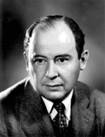

2016.1.24-24
============
今天要介绍的是被称为“计算机之父”的约翰·冯·诺伊曼（德语：John von Neumann，1903年12月28日－1957年2月8日），是出生于匈牙利的美国籍犹太人数学家，现代计算机与博弈论的重要创始人，在泛函、遍历论、几何、拓扑和数值分析等众多数学领域及计算机学、量子力学和经济学中都有重大贡献。冯·诺伊曼从小就以过人的智力与记忆力而闻名。冯·诺伊曼一生中发表了大约150篇论文，其中有60篇纯数学论文，20篇物理学以及60篇应用数学论文。他最后的作品是一个在医院未完成的手稿，后来以书名《计算机与人脑》发布，表现了他生命最后时光的兴趣方向。

1926年，冯·诺伊曼以22岁的年龄获得了布达佩斯大学数学博士学位，相继在柏林大学和汉堡大学担任数学讲师。

1930年，冯·诺伊曼接受了普林斯顿大学客座教授的职位。初到美国时，他在纽约对当地居民表演过默记电话簿的惊人记忆力。1931年，冯·诺伊曼成为普林斯顿大学终身教授。1933年转入普林斯顿高等研究院，与爱因斯坦等人成为该院最初的四位教授之一，不须上课。这一年，他部分解决了希尔伯特第五问题，证明了局部欧几里得紧群是李群。1937年成为美国公民，1938年获博修奖。

1945年6月，冯·诺伊曼与戈德斯坦、勃克斯等人，联名发表了一篇长达101页纸的报告，即计算机史上著名的“101页报告”，是现代计算机科学发展里程碑式的文献。明确规定用二进制替代十进制运算，并将计算机分成五大组件，这一卓越的思想为电子计算机的逻辑结构设计奠定了基础，已成为计算机设计的基本原则。1951年，EDVAC计算机宣告完成。由于他在计算机逻辑结构设计上的伟大贡献，他被誉为“计算机之父”。

2016.1.24