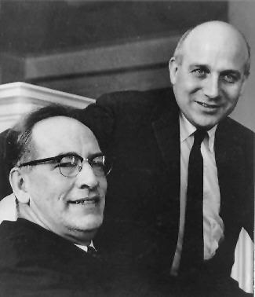

2016.1.25-25
============
约翰·莫奇利（1907.8.20~1980.1.8）是美国物理学家，他和J. Presper Eckert一起设计了ENIAC，这是第一个通用电子数字计算机，此外还有EDVAC、BINAC和UNIVAC I，UNIVAC I是美国第一台商用电子计算机。

他们一起创立了第一家计算机公司EMCC，并且开创了基本的计算机概念，包括存储程序、子程序和编程语言。他们的工作在《First Draft of a Report on the EDVAC》中有体现，并在Moore School Lectures进行传授。影响了全球40年代末计算机的大发展。

1941年，莫奇利在宾夕法尼亚大学的摩尔电子工程学院听过一节关于战时电子学的课程，在那里，他遇到了J. Presper Eckert。莫奇利摩尔学院接受了一个教学岗位，摩尔学院作为战时的计算中心。Eckert鼓励莫奇利相信通过适当的工程实践真空管可以被做的可靠。1942年，莫奇利写了一个备忘录提出建立通用的电子计算机。提议指出通过使用数字电子而没有移动的零件会获得巨大的速度优势。1943年4月，军队和摩尔学院签订协议来建造ENIAC。莫奇利领导概念设计，而Eckert进行硬件工程设计。许多有才华的工程师对这个机密的“Project PX”有贡献。

莫奇利和Eckert意识到机器的限制，开始计划第二台电脑，称为EDVAX。1945年1月，他们获得合同来建造这台存储程序计算机。Eckert提出一个水银延迟线存储器来存储程序和数据。那一年的晚些时候，数学家约翰·冯·诺依曼知道了这个项目，加入进来进行一些工程讨论。他写了一份内部文件来描述EDVAC。冯·诺依曼结构一词源自冯·诺依曼的论文“First Draft of a Report on the EDVAC”

1947年，莫奇利和Eckert成立了第一家计算机公司EMCC。他们获得了国家标准技术研究所的合同来建造“EDVAC II”，后来被改名为UNIVAC。UNIVAC是第一台用于商业应用而设计的，有着许多显著的技术优势例如大容量的存储磁带。作为一个过渡产品，公司创建和交付了一个更小的计算机BINAC。

2016.1.25