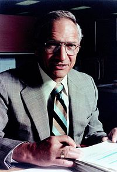

2016.1.27-27
============
罗伯特·诺顿·诺伊斯（英语：Robert Norton Noyce，1927年12月12日－1990年6月3日），是仙童半导体公司（1957年创立）和英特尔（1968年创立）的共同创始人之一，他有“硅谷市长”或“硅谷之父”（the Mayor of Silicon Valley）的绰号。诺伊斯也是电子器件集成电路的发明者之一，[1]他的发明对个人电脑的普及起到关键性的作用。

罗伯特·诺伊斯生于美国爱荷华州东南的登马克（Durlington）镇，排行老三。父亲是教堂的牧师，因此小时候的罗伯特跟随家人四处迁移，8岁时，搬往迪科拉，他把大量的时间都花在地下室工作间里。中学毕业后入读格林内尔学院（Grinnell College），修读物理、数学两个专业，物理系主任伽尔教授（G．O．Gale）在课堂上出示了约翰·巴丁发明的晶体三极管，引起诺伊斯的极大兴趣。诺伊斯在学校是游泳选手，并且在1947年的美国中西部地区游泳锦标赛上夺冠。他还会演奏双簧管，并在当地电台表演连续剧。1953年获麻省理工学院物理学博士学位，博士论文题为“绝缘体表面状态的光电研究”（Photoelectric Study of Surface States on Insulators）。毕业后3年在费尔科（Philco）公司工作。

1956年初，科学家威廉·肖克利（William Shockley）决定创办半导体公司，诺伊斯决定追随其成就一番大事业，由于工作人员都是博士，被称为“博士生产线”。1957年，诺伊斯不满肖克利的专制管理体制，与摩尔等8人集体辞职，在风险投资商Arthur Rock和Sherman Fairchild的资助下，创立仙童（Fairchild）半导体公司，被肖克利称为“8个叛徒”（traitorous eight）。

1959年1月，诺伊斯写出打造集成电路的方案，开始进行研发，利用一层氧化膜作为半导体的绝缘层，制作出铝条连线，使元件和导线合成一体。不过这时德州仪器（TI）的杰克·基尔比（Jack Kilby）已经制成集成电路，但他的设计不实际。同年7月30日，仙童提出“半导体器件——连线结构”（美国专利 2,981,877 ）的专利申请，至于基尔比的专利直到1964年6月23日才被批准。1969年法院判决，诺伊斯和基尔比发明的集成电路不存在侵权问题，两专利都有效。

1957年，苏联成功发射人造卫星。1959年美国国家航空航天局决定把人类送上月球。阿波罗航天飞机选用诺伊斯的集成电路。

1968年8月，诺伊斯与戈登·摩尔（Gordon Moore）和安迪·葛洛夫（Andrew Grove）一起辞职，创立英特尔（Integrated Electronics）。诺伊斯开创了没有墙壁的隔间办公室新格局。1971年11月，Intel 4004微处理器芯片问世。罗伯特·诺伊斯更是被称为“硅谷市长”。

诺伊斯兴趣广泛。他喜欢潜水、滑雪，还会驾驶飞机。1990年6月3日，诺伊斯因游泳时突然心脏病发作而去世，享年62岁。

2016.1.27